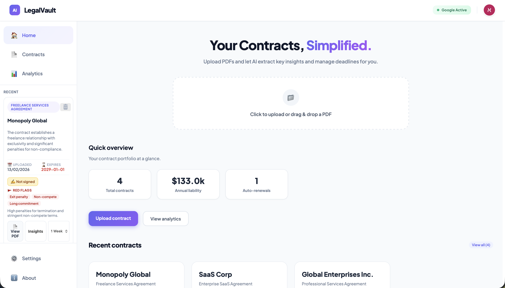
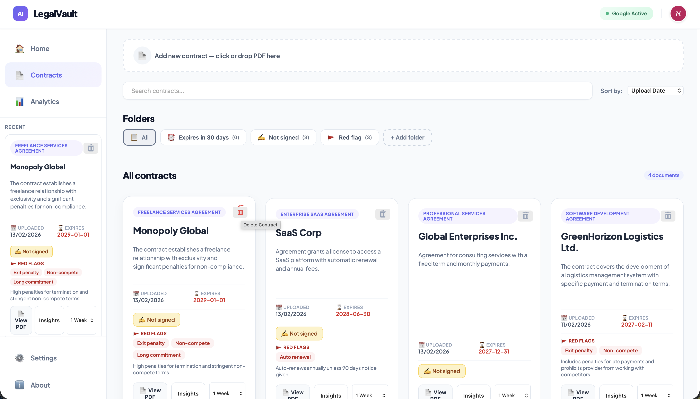
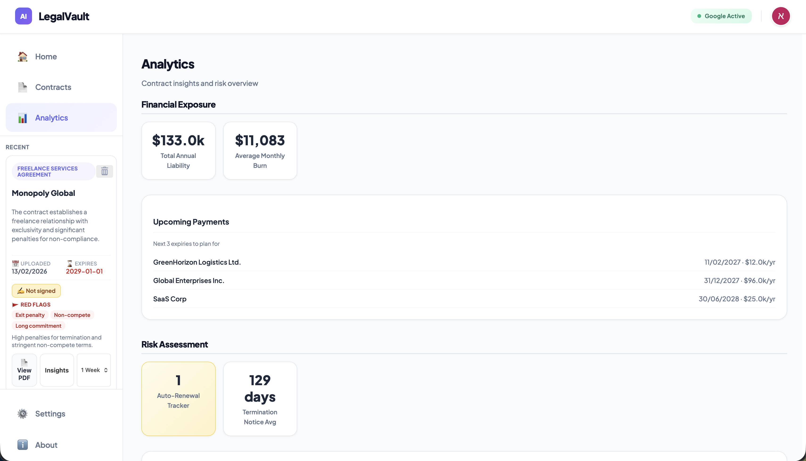
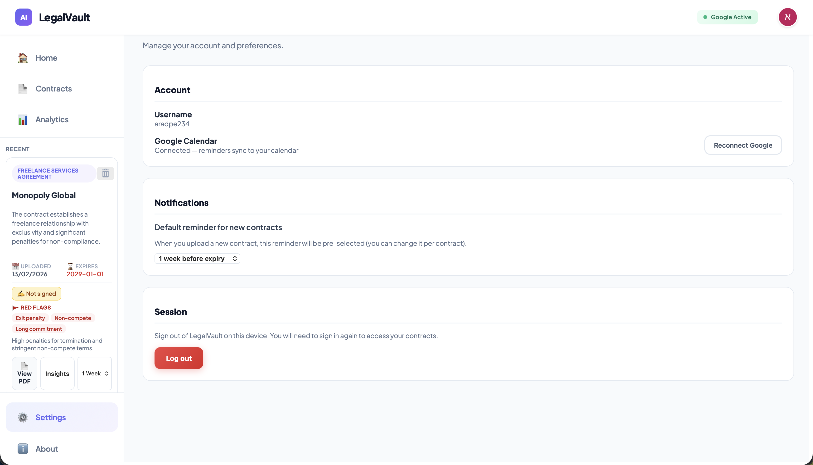
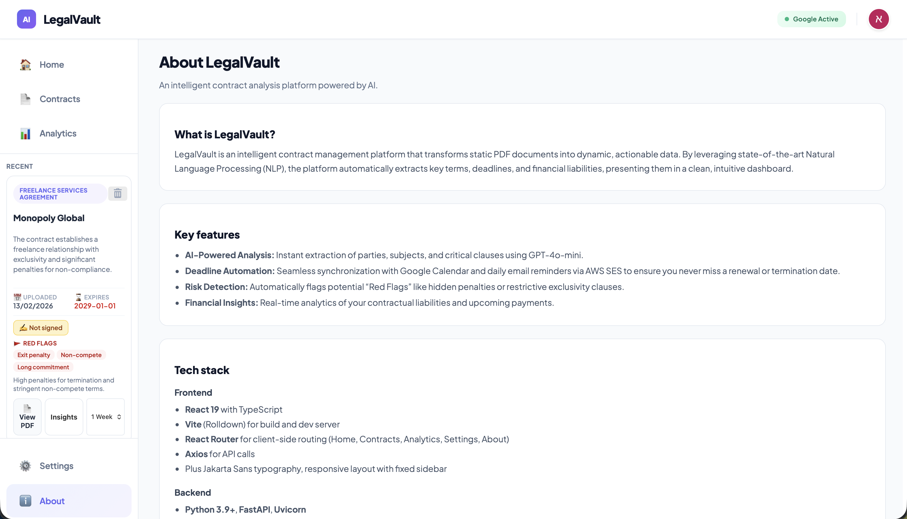
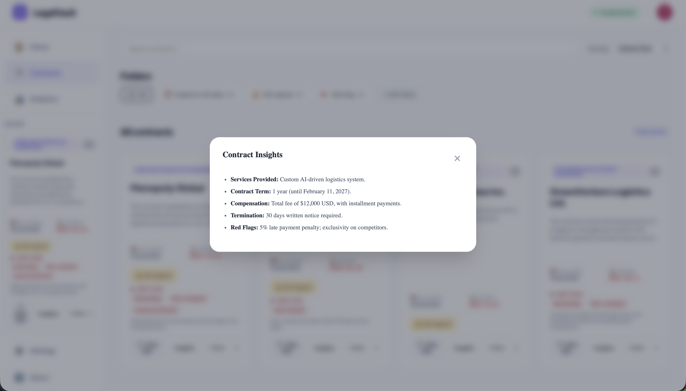
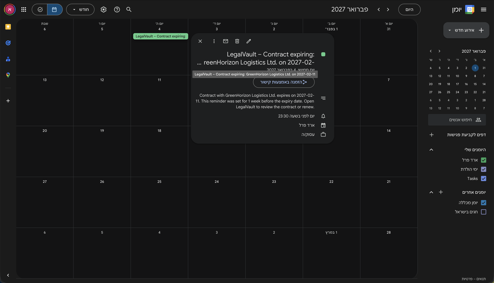

# LegalVault — Contract Manager AI

**Your contracts, simplified.** Upload PDFs and let AI extract key insights, track expirations, and manage reminders—all in one place.

---

## See it in action

*Add your screenshots to the `screenshots/` folder so they appear below. No need to run the app—HR and recruiters can see the product at a glance.*

| [Home](#home) | [Contracts](#contracts-page) | [Analytics](#analytics-page) |
|---------------|------------------------------|------------------------------|
|  |  |  |

| [Login](#login) | [Settings](#settings-page) | [About](#about-page) | [Analyzed contract](#analyzed-contract) |
|-----------------|----------------------------|----------------------|----------------------------------------|
|  |  |  |  |

| [Google Calendar event](#google-calendar-event) |
|-------------------------------------------------|
|  |

*Caption: Home • Contracts • Analytics • Login • Settings • About • Contract card • Google Calendar reminder*

---

## What is LegalVault?

**LegalVault** is an intelligent contract management web app. Users sign up, upload PDF contracts, and get instant AI-powered analysis: key terms, parties, expiry dates, and risk flags. They can organize contracts into folders, set expiration reminders (synced to Google Calendar), and view analytics on their portfolio—total liability, upcoming payments, and red-flag summaries. The app also sends **automated email reminders** via **AWS SES** one week before a contract expires: **AWS EventBridge** runs every morning at 8:00 and triggers an **AWS Lambda** function, which sends those emails through SES. Everything is built with a modern React frontend and a Python/FastAPI backend, using AWS (DynamoDB, S3, Lambda, SES, EventBridge) and external services (OpenAI, Google Calendar).

---

## What you see (screenshots explained)

### Home

The **Home** page is the landing view after login. It shows a hero line (“Your Contracts, Simplified”), a drag-and-drop upload area for PDFs, a quick overview (total contracts, annual liability, auto-renewals), and a “Recent contracts” list. Users can upload a contract here and jump to Contracts or Analytics.

### Contracts page

The **Contracts** page is the main workspace. A compact upload bar sits at the top. Below, **system folders** (All, Expires in 30 days, Not signed, Red flag) and **custom folders** (user-created, with name/color/symbol) let users filter and group contracts. Each contract appears as a **card** with: subject, counterparty, short summary, upload/expiry dates, “Not signed” when relevant, red-flag tags, and actions (View PDF, Insights, reminder dropdown, delete). The sidebar shows the same full cards for **recent** contracts and quick access to Settings and About.

### Analytics page

The **Analytics** page gives a high-level view of the contract portfolio: total contracts, annual liability, upcoming payments, auto-renewal count, notice periods, risk breakdown, and top counterparties. It helps users see exposure and deadlines at a glance.

### Sidebar and navigation

A **fixed sidebar** offers: Home, Contracts, Analytics, then a scrollable **Recent** section with full contract cards, and at the bottom **Settings** (account, default reminder, Logout) and **About** (product info, AWS & external services, developer).

### Login

The **Login / Sign up** screen is shown when the user is not authenticated. It includes a simple form (username, and email for signup), “Welcome back” / “Create your account” copy, and primary action buttons. No app features are available until the user signs in.

### Settings page

The **Settings** page lets users manage their account: view current user, set a default reminder preference, and **Logout**. Google Calendar connection status can be shown here as well.

### About page

The **About** page describes the product (“What is LegalVault?”, key features), lists **AWS & external services** (DynamoDB, S3, Lambda, EventBridge, SES, Google Calendar, daily email), and includes an **About the developer** section (e.g. name, institution).

### Analyzed contract

An **analyzed contract** is shown as a **contract card**: type badge, counterparty name, short summary, uploaded date, expiry date, “Not signed” pill when relevant, red-flag tags (e.g. Non-compete), and actions (View PDF, Insights, reminder dropdown). This is the same card used on Home, Contracts, and in the sidebar Recent list.

### Google Calendar event

When the user connects **Google Calendar**, expiration reminders can be created as events (e.g. 1 week or 1 month before expiry). The screenshot shows how such a reminder appears in Google Calendar—same contract and deadline the user sees in LegalVault.

---

## Key features (at a glance)

- **AI contract analysis** — Extract subject, parties, dates, key terms, and risk flags from PDFs (OpenAI).
- **Folders** — System filters (All, Expires 30d, Not signed, Red flag) plus custom folders (create, assign, delete).
- **Signing and risk** — “Not signed” detection and red-flag labels on cards and in filters.
- **Google Calendar** — Connect account and set per-contract reminders (e.g. 1 week / 1 month before expiry); events appear in the user’s calendar as in the screenshot.
- **Automated email reminders** — **AWS EventBridge** runs every morning at 8:00 and triggers **AWS Lambda**, which uses **AWS SES** to send the user an email one week before a contract expires.
- **Secure storage** — PDFs in AWS S3; metadata and user data in DynamoDB.
- **Multi-page UI** — Home, Contracts, Analytics, Settings, About with React Router and a consistent sidebar.

---

## Tech stack

| Layer | Technologies |
|-------|--------------|
| **Frontend** | React 19, TypeScript, Vite, React Router, Axios |
| **Backend** | Python 3.9+, FastAPI, Uvicorn, PyMuPDF (PDF text extraction) |
| **AI & data** | OpenAI GPT-4o-mini, AWS DynamoDB, AWS S3, AWS Lambda, AWS SES, AWS EventBridge |
| **Integrations** | Google Calendar API, Google OAuth 2.0 |

---

## Prerequisites

To run the project locally you need:

- **Python 3.9+** and **Node.js 16+** (npm)
- **AWS** — DynamoDB tables, S3 bucket, IAM user with correct permissions
- **Google Cloud** — Project with Calendar API enabled and OAuth 2.0 credentials
- **OpenAI** — API key

---

## Getting started

### 1. Clone and install

```bash
git clone https://github.com/YOUR_USERNAME/contract_manager.git
cd contract_manager
```

### 2. Backend

```bash
cd backend
python3 -m venv venv
source venv/bin/activate   # Windows: venv\Scripts\activate
pip install fastapi uvicorn boto3 openai python-dotenv pymupdf passlib[bcrypt] google-auth-oauthlib google-api-python-client
```

Create a `.env` in `backend/` with:

```env
AWS_ACCESS_KEY_ID=...
AWS_SECRET_ACCESS_KEY=...
AWS_REGION=us-east-1
S3_BUCKET_NAME=...
OPENAI_API_KEY=...
GOOGLE_CLIENT_ID=...
GOOGLE_CLIENT_SECRET=...
FRONTEND_URL=http://localhost:5173
```

### 3. AWS

- **DynamoDB**: Tables `Users` (partition key: `username`) and `Analyzed_Contracts` (partition: `user_id`, sort: `contract_id`). See `backend/FOLDERS_TABLE.md` for the folders table.
- **S3**: One bucket for PDFs; IAM allowed: `PutObject`, `GetObject`, `GeneratePresignedUrl`.

### 4. Google Cloud

- Enable **Google Calendar API**.
- Create **OAuth 2.0** “Web application” credentials; redirect URI: `http://localhost:8000/auth/callback`.
- Consent screen scope: `https://www.googleapis.com/auth/calendar.events`.

### 5. Run

```bash
# Terminal 1 – backend
cd backend && uvicorn main:app --reload

# Terminal 2 – frontend
cd client && npm install && npm run dev
```

- Backend: `http://localhost:8000`  
- Frontend: `http://localhost:5173`

---

## Project structure (high level)

```
contract_manager/
├── backend/
│   ├── main.py              # FastAPI app, CORS, routes
│   ├── config.py            # Env / settings
│   ├── routers/             # contracts, folders, google_auth
│   ├── services/            # AI analysis, etc.
│   └── FOLDERS_TABLE.md     # DynamoDB folders schema
├── client/
│   ├── src/
│   │   ├── App.tsx          # Auth, context, modals, routes
│   │   ├── layouts/         # AppLayout (sidebar + Outlet)
│   │   ├── pages/           # Home, Contracts, Analytics, Settings, About
│   │   ├── components/      # Navbar, ContractCard, CompactUploadBar, etc.
│   │   ├── context/         # AppContext
│   │   └── apiService.ts
│   └── package.json
├── screenshots/             # Add home.png, contracts.png, analytics.png here
└── README.md
```

---

## API overview

| Area | Endpoints |
|------|-----------|
| **Auth** | `POST /signup`, `POST /login` |
| **Contracts** | `POST /upload`, `GET /contracts?user_id=`, `GET /view/{id}`, `DELETE /contracts/{id}` |
| **Folders** | `GET/POST/DELETE /folders` (see backend) |
| **Google** | `GET /auth/google`, `GET /auth/callback`, `GET /check-google-connection`, `POST /update-reminder` |

---

## Troubleshooting

- **Port in use** — Backend: `lsof -ti:8000 \| xargs kill -9`. Frontend: `npm run dev -- --port 5174`.
- **AWS/Google errors** — Check `.env`, IAM permissions, DynamoDB table names, and OAuth redirect URI.
- **CORS** — Ensure backend CORS allows `FRONTEND_URL`.

---

## Security and production

- Do not commit `.env`. Use env vars for all secrets.
- Production: set `FRONTEND_URL` and Google redirect to production URLs, use HTTPS, and restrict CORS.

---

**LegalVault** — *Your contracts, simplified.*

For detailed setup (e.g. DynamoDB schema, folder API), see the backend docs and `FOLDERS_TABLE.md`.
